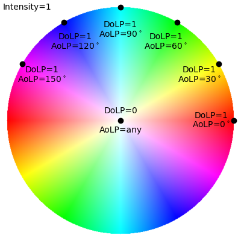

# polar_viz
Visualize linear polarization with HSV color space.

Tested with Python 3.6.



| Image taken with FLIR BFS-U3-51S5P-C                   | After processing                                           |
| ------------------------------------------------------ | ---------------------------------------------------------- |
|  |  |

## Usage

```bash
$ python3 polar_viz.py
Select video or image file:
0       ...
1       ...
2       polar_vis_test.bmp
3       ...
```

Enter `2` and a file named `polar_vis_test_vis.png` will be generated, overwriting if it already exists.

## References

* https://en.wikipedia.org/wiki/Stokes_parameters
* https://github.com/elerac/polanalyser
